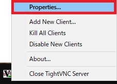
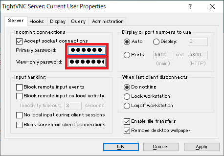
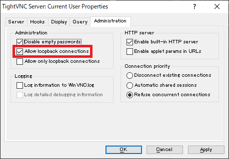
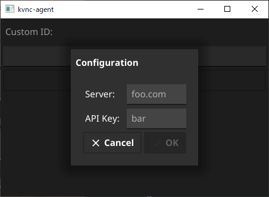
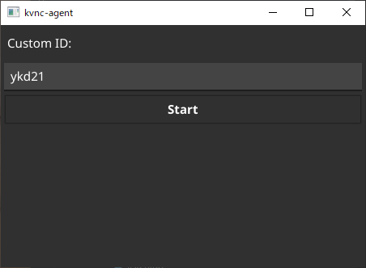
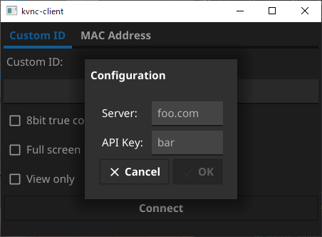
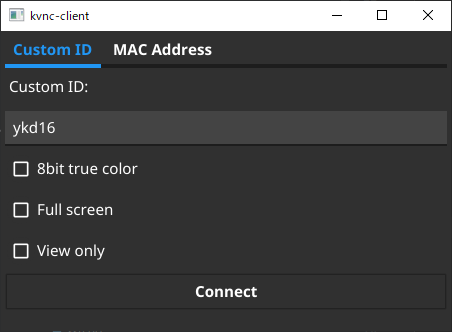
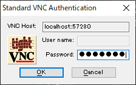

kvnc
====

[Kaginawa](https://github.com/kaginawa/kaginawa)-powered VNC connection utilities.

## Download

See [Releases](https://github.com/kaginawa/kvnc/releases) page.

## Setup

### Windows

Get the following files and place them in the same folder.

| File | Description | Download page |
| --- | --- | --- |
| `kvnc-client.exe` | kvnc client utility | [GitHub](https://github.com/kaginawa/kvnc/releases) |
| `kvnc-agent.exe`  | kvnc agent utility | [GitHub](https://github.com/kaginawa/kvnc/releases) |
| `kaginawa.exe`    | kaginawa | [GitHub](https://kaginawa.github.io/) |
| `vncviewer.exe`   | TightVNC client | [TightVNC](https://www.tightvnc.com/download-old.php) |
| `WinVNC.exe`      | TightVNC server | [TightVNC](https://www.tightvnc.com/download-old.php) |

Tested VNC versions:

- TightVNC 1.3.10

## Usage

### Server

1. (1st time only) Run `WinVNC.exe`.
2. (1st time only) Right-click the task tray icon and open [Properties...].

    

3. (1st time only) Input the **Primary password** and **view-only password**.

    
    
4. (1st time only) Select [Administration] tab, check **Allow loopback connections** and press [OK].

    
    
1. Run `kvnc-agent.exe`.
2. (1st time only) Input server and API key and press [OK].
   
    

3. Input own custom ID and press [Start].

    

4. If "Working" is displayed, the agent is working.
5. Please tell the client your custom ID and VNC password.

### Client

1. Run `kvnc-client.exe`.
2. (1st time only) Input server and API key and press [OK].

    

3. Input target custom ID (or MAC address) and press [Connect].

    

4. Input password and press [OK].

    

5. Enjoy!

## License

kvnc licenced under [BSD 3-Clause](LICENSE).

## Author

[mikan](https://github.com/mikan)
